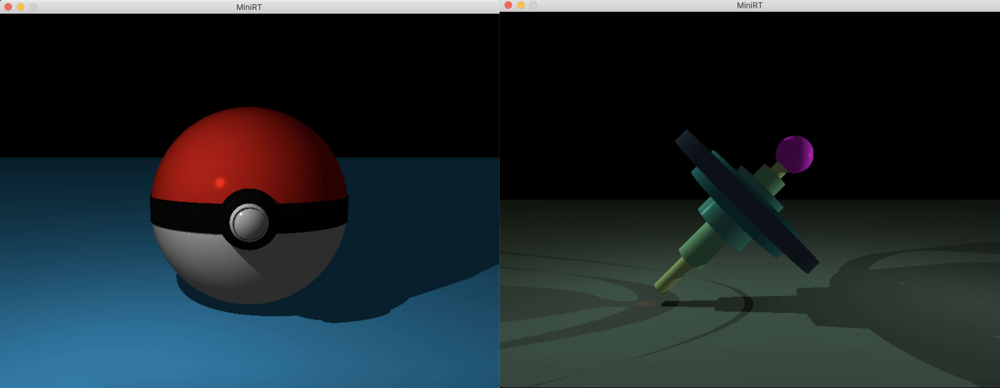

# MiniRT
This is the second graphics project at [42](42.fr), our first RayTracer with miniLibX.

### What is miniRT?
It is a team project at [42](42.fr) that asks us to create a RayTracing engine with [miniLibX](https://github.com/42Paris/minilibx-linux). The [Ray Tracing](https://en.wikipedia.org/wiki/Ray_tracing_(graphics)) method, developed for the first time in 1968 (but improved upon since) is even today more expensive in computation than the [Rasterization](https://en.wikipedia.org/wiki/Rasterisation) method. As a result, it is not yet fully adapted to real time use-cases but it produce a much higher degree of visual realism.

### Images Rendered


#### Skills
- Rigor
- Imperative programming
- Graphics
- Algorithms & AI

## Getting started
**Follow the steps below**
```bash
# Requirements: X11 miscellaneous extensions library and Utility functions from BSD
# To install the dependencies, open the terminal window and write
sudo apt-get install libxext-dev libbsd-dev

# Clone the project and access the folder
git clone https://github.com/Scaramovistk/MiniRayTracing.git && cd MiniRayTracing/

# Run make for a simple vertion
make

# Run make bonus for the stylish vertion
make bonus

# Run it with one of these scenes as an argument
./miniRT ./scenes/pokeball.rt
./miniRT ./scenes/whirl.rt.rt

# Clean output objects with
make fclean

# Well done!
```
---

Made by:
Sandra Munyanshoza 👋 <br />Gabriel Scaramal 👋
